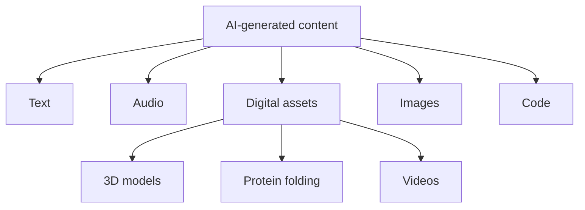
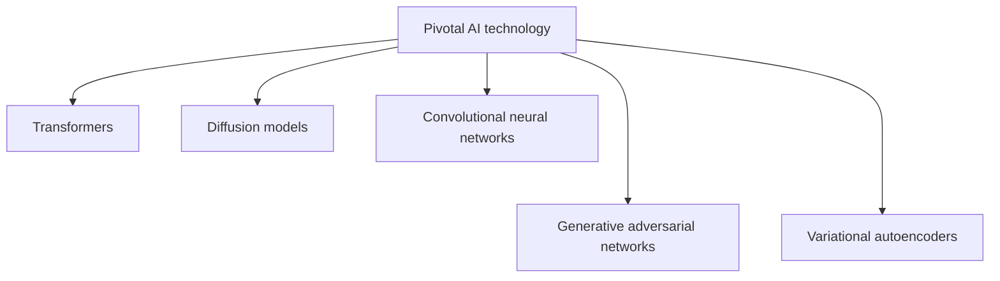
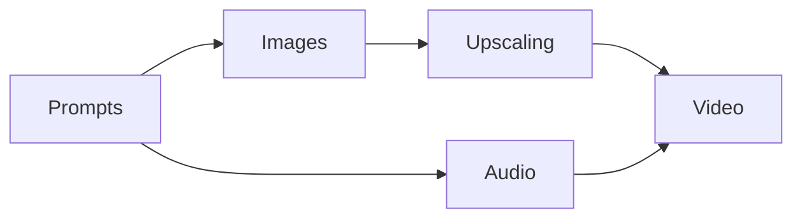
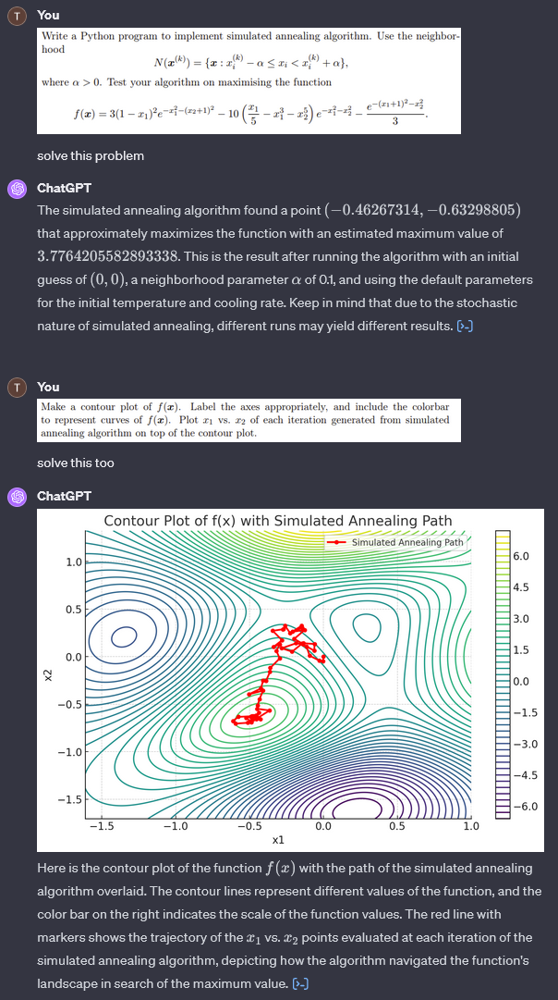
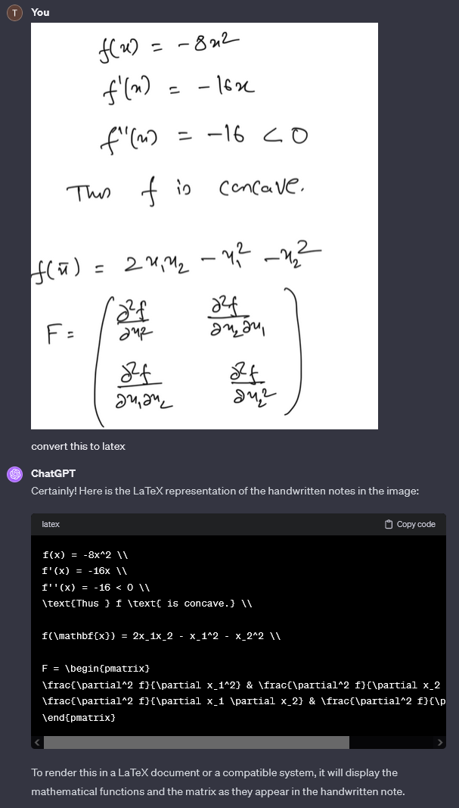
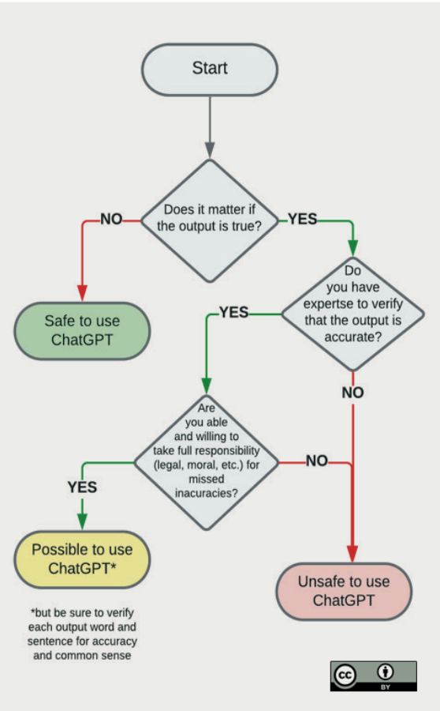

# AI and mathematics education

*N.B. This is a work-in-progress filled with broad strokes of non-pedancy.*

This document is meant to give a rough overview of generative AI in relation to mathematics education, and to highlight some questions (please solve these as your homework) we might want to ask ourselves as educators:

1. What is generative AI capable of?
1. What impact does generative AI have on mathematics education?
1. How can we integrate AI into our teaching and assessments?
1. How can students integrate AI into their learning journey?
1. How do we tackle AI-driven academic misconduct?
1. How is this different from essay mills, plagiarism, unauthorised use of technology, collaboration, impersonation, etc.?
1. No, really, how is this any different?

## Generative AI at a glance

Simply put, generative AI refers to artificial intelligence systems that are capable of generating *new* content based on existing training data.

Here are some examples of media that generative AI is capable of producing:

AI advancements were brought about by key deep learning machinery:

What follows are examples of popular generative AI tools.

### Large language models (LLMs)

[Transformer models](https://arxiv.org/abs/1706.03762) (the hot new thing!) are mainly used to train LLMs; these can be thought of as  sophisticated chatbots.

##### General purpose LLMs:
- [ChatGPT](https://chat.openai.com/]) - OpenAI's LLM.
- [Microsoft Copilot](https://copilot.microsoft.com/) - AI companion for Microsoft 365 apps.
- [Llama 2](https://ai.meta.com/llama/) - open source LLM.

##### Customized LLMs:
- [GPTs](https://chat.openai.com/gpts) - storefront for customized ChatGPTs.
- [Wolfram GPT](https://www.wolfram.com/wolfram-plugin-chatgpt/) - ChatGPT customized for mathematics and data visualization.
- [GitHub Copilot](https://github.com/features/copilot) - AI-based code suggestions.
- [NovelAI](https://novelai.net/) - storytelling.
- [Friends & Fables](https://www.fables.gg/) - AI game master for tabletop RPGs.
- [AI Dungeon](https://play.aidungeon.com/) - infinitely generated text adventure.

##### LLM (and other AI) communities and providers
- [Hugging Face](https://huggingface.co/) - general machine learning community.
- [There's An AI For That](https://theresanaiforthat.com/) - find an AI tool that suits your needs.
- [NVIDIA](https://www.nvidia.com/en-gb/ai-data-science/) - AI infrastructure.
- [AMD](https://www.amd.com/en/solutions/ai.html) - AI infrastructure.

### Diffusion models

Diffusion models can be used for text-to-video and text-to-image generation; you may have heard of them in the context of deepfakes and art generators.

##### Text-to-video:
- [Lumiere](https://lumiere-video.github.io/) - video synthesis.
- [Synthesia](https://www.synthesia.io/) - AI avatars.

##### Text-to-image:
- [Stable Diffusion](https://stability.ai/stable-image) - open source diffusion models.
- [DALL·E](https://labs.openai.com/) - ChatGPT customized for image generation.
- [Midjourney](https://www.midjourney.com/)

### Deep neural networks 

Convolutional neural networks (CNNs), generative adversarial networks (GANs), and variational autoencoders (VAEs) are deep learning models that can be used to construct generative AI tools.

- [DeepL](https://www.deepl.com/translator) - language translation.
- [Upscale.media](https://www.upscale.media/) - image upscaling.
- [waifu2x](https://github.com/nagadomi/waifu2x) - video upscaling.
- [D-ID](https://www.d-id.com/creative-reality-studio/) - video synthesis.
- [||ElevenLabs](https://elevenlabs.io/) - audio synthesis.
- [NVIDIA DLSS](https://www.nvidia.com/en-gb/geforce/technologies/dlss/) - Frame generation, upscaling, and noise removal in video games.
- [Mantella](https://www.nexusmods.com/skyrimspecialedition/mods/98631) - AI-powered NPC dialogue in Skyrim.

### AI-integrated workflows

- [AI-powered workflows for math teaching and research](https://lpetrov.cc/AI-math/) - how a mathematician integrates AI tools into their workflow.
- [Harry Potter by Balenciaga](https://www.youtube.com/watch?v=iE39q-IKOzA) - Harry Potter characters re-imagined as Balenciaga models.

*Harry Potter by Balenciaga workflow where AI tools can and were used at every step.*

### Capability

Generative AI can be quite good at certain tasks!

#### Data analysis
*Analyzing an uploaded data set (Pearson and Lee, 1903) using Data Analyst, a custom version of ChatGPT.*

*Supplementary regression analysis Python code provided by Data Analyst.*

#### Problem solving
*Solving a homework question (6024CEM Optimisation, Problem Set 7).*

#### OCR and LaTeX generation
*Converting handwriting (6024CEM Optimisation, Problem Set 7 solutions) to LaTeX code.*

### Hallucination

Generative AI can be wrong, and very confidently so!

- [Hallucination Leaderboard](https://github.com/vectara/hallucination-leaderboard/) - Public LLM hallucination leaderboard using Vectara's Hallucination Evaluation Model.

*DALL·E is bad at generating text.*

*Copilot's attempt at random number generation.*

### Prompt engineering

> Prompt engineering is creating inputs for AI to get better outputs. It's important for accurate, efficient, and ethical AI responses. — *ChatGPT 4*

- [MathPrompter: Mathematical Reasoning using Large Language Models](https://arxiv.org/abs/2303.05398)
- [The DALL·E 2 Prompt Book](https://dallery.gallery/the-dalle-2-prompt-book/)
- [AI Prompt Vault](https://lunarmimi.net/ref-vault/)

### Identifying AI-generated content

- [How do Turnitin’s AI writing detection capabilities work?](https://www.turnitin.com/products/features/ai-writing-detection/)
- [New AI classifier for indicating AI-written text](https://openai.com/blog/new-ai-classifier-for-indicating-ai-written-text) - OpenAI's failed attempt at an AI classifier.

*Misrepresenting an AI-generated image.*

## Generative AI in higher education

> The use of AI in higher education, specifically in mathematics, has been evolving and expanding, offering various innovative approaches to teaching, learning, and research. Here's a rundown of some of the key uses and benefits:
> 
> 1. **Personalized Learning**: AI can tailor the educational experience to individual students' needs. It can assess each student's current understanding, learning pace, and preferred learning style. Based on this data, AI can provide personalized resources, recommend specific topics for revision, or adjust the difficulty level of problems.
> 
> 2. **Automated Grading and Feedback**: AI systems can grade assignments and provide instant, personalized feedback. This is particularly useful in large classes. For complex mathematical problems, AI can not only check the final answer but also evaluate the reasoning and steps taken to reach that answer, offering constructive feedback.
> 
> 3. **Interactive Tutorials and Problem Solving**: AI-driven platforms can offer interactive tutorials, where students engage with AI tutors that respond to their inputs. These systems can guide students through problem-solving processes, offering hints or suggestions and explaining concepts when students struggle.
> 
> 4. **Data-Driven Insights for Instructors**: AI can analyze data on students' performance and learning behaviors, offering insights to instructors about common difficulties or misconceptions. This information can guide instructors to adjust their teaching methods or to address specific topics more thoroughly.
> 
> 5. **Virtual Labs and Simulations**: In mathematics, certain concepts can be abstract and challenging to visualize. AI can power virtual labs and simulations that offer visual and interactive representations of complex mathematical theories or problems, enhancing understanding and engagement.
> 
> 6. **Enhancement of Research**: AI can assist in mathematical research by processing large datasets, identifying patterns, and even suggesting new avenues of research. Machine learning models and algorithms can help in solving complex mathematical problems, sometimes even discovering proofs or solutions that were not previously apparent.
> 
> 7. **Accessibility**: AI can make learning more accessible. For instance, voice recognition and AI-driven assistants can help students with disabilities engage with mathematical content more effectively.
> 
> 8. **Combatting Academic Dishonesty**: AI systems can be used to monitor and detect instances of academic dishonesty, ensuring the integrity of the academic process.
> 
> While the integration of AI in mathematics higher education offers numerous benefits, it's also accompanied by challenges such as ensuring the quality and fairness of AI systems, protecting student privacy, and maintaining a balance between technological and human elements in education. As AI technology continues to evolve, its role in mathematics and higher education at large is expected to grow, offering new opportunities for enhancing teaching, learning, and research.
> 
> — *ChatGPT 4*

- [ChatGPT and Assessments in the Mathematical Sciences](http://talmo.uk/blog/feb2023/chatgpt.html)
- [ChatGPT in Computing Education](https://www.mmu.ac.uk/sites/default/files/2023-12/ChatGPTComputingEducationWhitePaper.pdf)
- [ChatGPT in education: global reactions to AI innovations](https://www.nature.com/articles/s41598-023-42227-6)
- [ChatGPT in education: Methods, potentials, and limitations](https://www.sciencedirect.com/science/article/pii/S2949882123000221)
- [Artificial Intelligence  - Staff Guidance, *Coventry University*](https://teach.coventry.domains/articles/artificial-intelligence-staff-guidance/)

> In the shorter term, we encourage staff tooffer students opportunities to learn how AI tools work, to openly discuss and debate the ethics of AI, the current strengths, and limitations of the technology, and if AI tools can be used appropriately, i.e., effectively, ethically, and transparently in relation to their assessments.
> — *Coventry University*

- [AI & Academic Misconduct](https://teach.coventry.domains/articles/ai-academic-misconduct/)
- [Maintaining quality and standards in the ChatGPT era: QAA advice on the opportunities and challenges posed by Generative Artificial Intelligence](https://www.qaa.ac.uk/docs/qaa/members/maintaining-quality-and-standards-in-the-chatgpt-era.pdf)

- [ChatGPT and artificial intelligence in higher education: quick start guide, *UNESCO*](https://unesdoc.unesco.org/ark:/48223/pf0000385146)

*When is it safe to use ChatGPT? (UNESCO)*

#### Learning and teaching integration

- *TBA, let's discuss!*

#### Re-designing assessment

Possibilities:
| Tactic  | Example | Effectiveness  | Ease-of-use   | Cost |
|---|---|---|---|---|
| Limiting access  | In-person assessments  | 😎  | 😎  | 🤔  |
| Proof-of-ownership  | Completion milestones  | 🤔  | 😎  | 😎  |
| Assessing AI literacy  | Grading emphasis on rigor/precision/explanation  | 🤔  | 😎  | 😎  |
| Limiting access  | Safe Exam Browser  | 🤔  | 🤔  | 🤔  |
| Obfuscation  | Writing un-AI-able questions  | 🤔  | 🤬  | 🤬  |
| AI writing detection  | Turnitin  | 🤬  | 🤬   | 🤬  |
| ? | ? | ? | ? | ? |

## Ethics and further reading

- [AI Content on Steam](https://steamcommunity.com/groups/steamworks/announcements/detail/3862463747997849619)
- [Toxicity in ChatGPT: Analyzing Persona-assigned Language Models](https://arxiv.org/abs/2304.05335)

Repositories of notes on generative AI:
- [AI Notes](https://github.com/swyxio/ai-notes/blob/main/README.md)
- [Stable Diffusion Akashic Records](https://github.com/Maks-s/sd-akashic)

