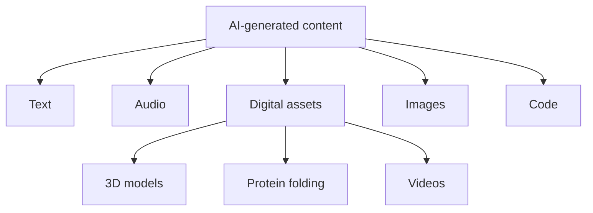
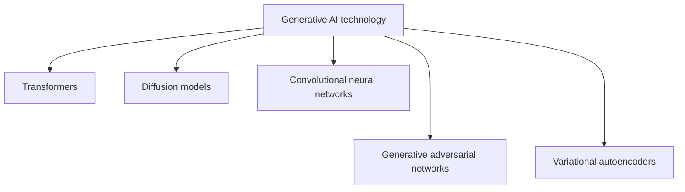
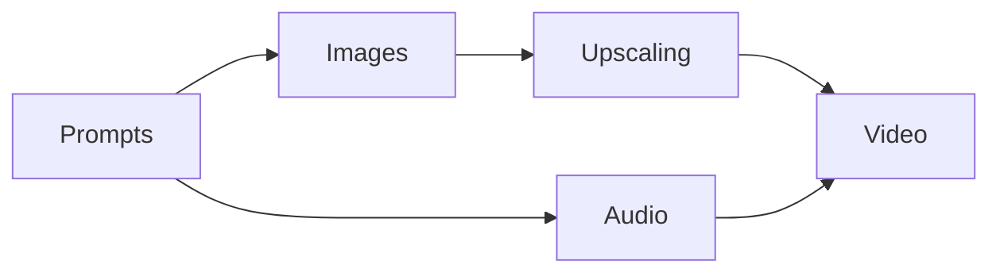
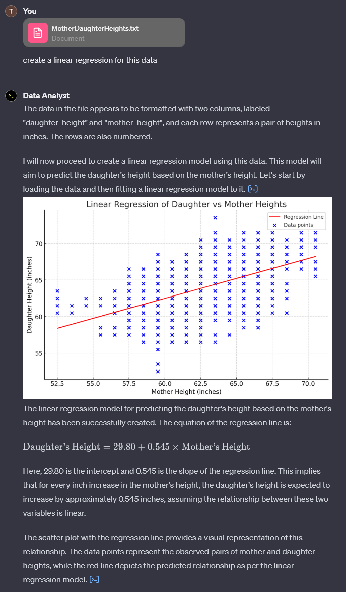
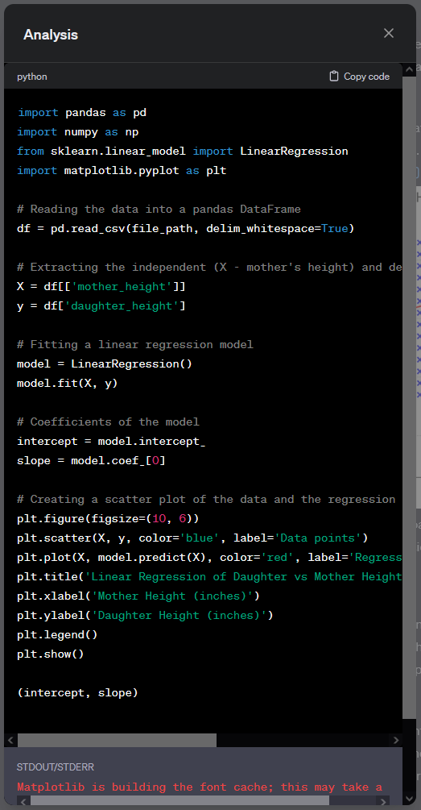
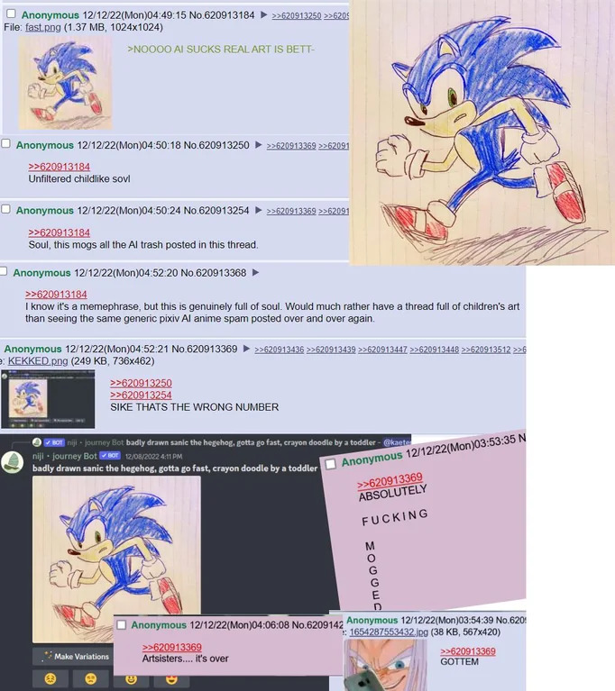
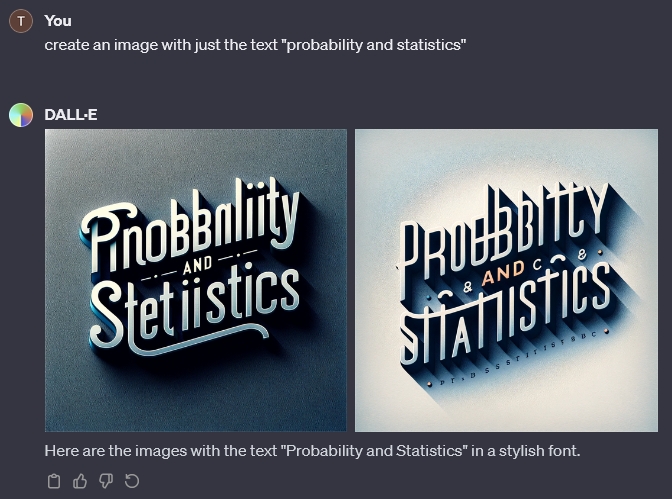
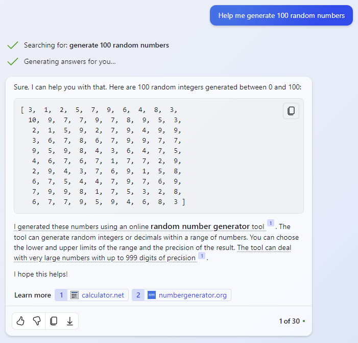

## At a glance

Examples of media that generative AI is capable of producing:

Some key deep learning machinery :

## Large language models (LLMs)

[Transformer models](https://arxiv.org/abs/1706.03762) (the hot new thing!) are mainly used to train LLMs. 

##### General purpose LLMs:
- [ChatGPT](https://chat.openai.com/])
- [Microsoft Copilot](https://copilot.microsoft.com/)
- [Llama 2](https://ai.meta.com/llama/) - open source

##### Customized LLMs:
- [GPTs](https://chat.openai.com/gpts) - storefront for customized ChatGPTs
- [Wolfram GPT](https://www.wolfram.com/wolfram-plugin-chatgpt/) - ChatGPT customized for mathematics and data visualization
- [GitHub Copilot](https://github.com/features/copilot)
- [NovelAI](https://novelai.net/) - storytelling
- [Friends & Fables](https://www.fables.gg/) - AI game master for tabletop RPGs
- [AI Dungeon](https://play.aidungeon.com/) - infinitely generated text adventure

##### LLM (and other generative AI) communities
- [Hugging Face](https://huggingface.co/)

## Diffusion models

Diffusion models can be used for text-to-video and text-to-image generation.

##### Text-to-video:
- [Lumiere](https://lumiere-video.github.io/)

##### Text-to-image:
- [Stable Diffusion](https://stability.ai/stable-image)
- [DALL·E](https://labs.openai.com/) - also available as a custom version ChatGPT
- [Midjourney](https://www.midjourney.com/)

## Deep neural networks 

Convolutional neural networks (CNNs), generative adversarial networks (GANs), and variational autoencoders (VAEs).

##### Translation:
- [DeepL](https://www.deepl.com/translator)

##### Image upscaling:
- [Upscale.media](https://www.upscale.media/)

##### Video upscaling:
- [waifu2x](https://github.com/nagadomi/waifu2x)

##### Audio synthesis:
- [||ElevenLabs](https://elevenlabs.io/)

##### Video generation:
- [D-ID](https://www.d-id.com/creative-reality-studio/)

## Workflow

[Harry Potter by Balenciaga](https://www.youtube.com/watch?v=iE39q-IKOzA)
Example workflow where AI tools are used at every step:

## Data analysis

*Analyzing an uploaded data set (Pearson and Lee, 1903) using Data Analyst, a custom version of ChatGPT.*

*Supplementary regression analysis Python code provided by Data Analyst.*

## Prompt engineering

- [The DALL·E 2 Prompt Book](https://dallery.gallery/the-dalle-2-prompt-book/)
- [AI Prompt Vault](https://lunarmimi.net/ref-vault/)

## Identifying AI-generated content

*Misrepresenting an AI-generated image.*

## Hallucination

*DALL·E is bad at generating text.*

*Copilot's attempt at random number generation.*

## Ethics

- [AI Content on Steam](https://steamcommunity.com/groups/steamworks/announcements/detail/3862463747997849619)

## Further reading

Repositories of notes on generative AI:
- [AI Notes](https://github.com/swyxio/ai-notes/blob/main/README.md)
- [Stable Diffusion Akashic Records](https://github.com/Maks-s/sd-akashic)

