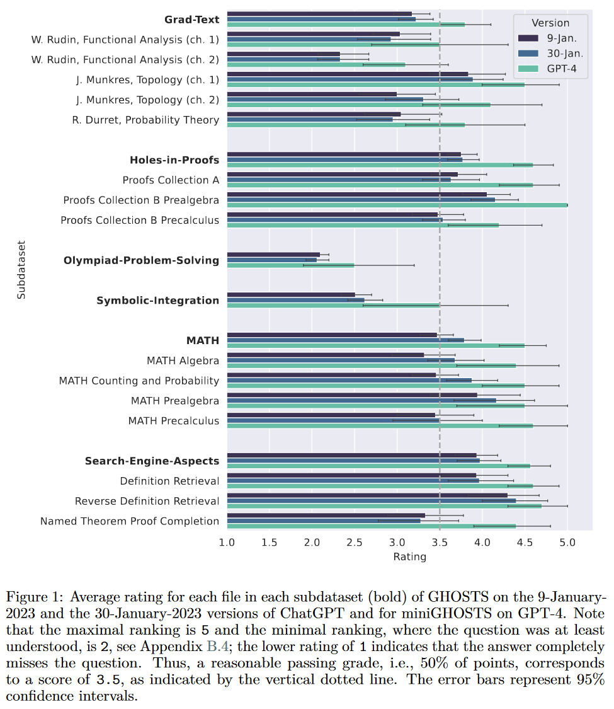
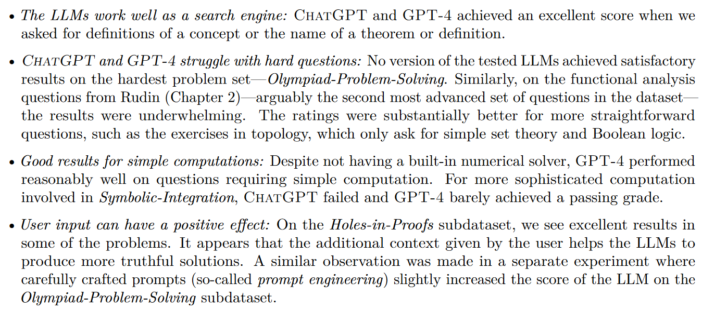

# Generative AI in higher education

## Some reading

#### General 

* UK Department for Education - [Generative AI call for evidence: summary of responses](https://www.gov.uk/government/calls-for-evidence/generative-artificial-intelligence-in-education-call-for-evidence)
- Coventry University - [Artificial Intelligence  - Staff Guidance, *Coventry University*](https://teach.coventry.domains/articles/artificial-intelligence-staff-guidance/)
* UCL - [Using generative AI (GenAI) in learning and teaching](https://www.ucl.ac.uk/teaching-learning/publications/2023/sep/using-generative-ai-genai-learning-and-teaching)
- TALMO - [ChatGPT and Assessments in the Mathematical Sciences](http://talmo.uk/blog/feb2023/chatgpt.html)
- White paper - [ChatGPT in Computing Education](https://www.mmu.ac.uk/sites/default/files/2023-12/ChatGPTComputingEducationWhitePaper.pdf)
- Literature review - [ChatGPT in education: Methods, potentials, and limitations](https://www.sciencedirect.com/science/article/pii/S2949882123000221)
- Literature review - [ChatGPT in education: global reactions to AI innovations](https://www.nature.com/articles/s41598-023-42227-6)

## Domain-specific

* Article - [Mathematical Capabilities of ChatGPT](https://proceedings.neurips.cc/paper_files/paper/2023/hash/58168e8a92994655d6da3939e7cc0918-Abstract-Datasets_and_Benchmarks.html)

* Article - [Large Language Models for Mathematicians](https://arxiv.org/abs/2312.04556)

---

## Teaching and learning

#### Creating resources

🤨

#### Lesson / course planning

🤨

#### In-lesson

🤨

---

## Assessment and feedback

#### Assessment

*Bloom's cognitive models*
| | Bloom (1956) | 2001 revision |
|--|--|--|
| Most advanced | Evaluation | Create |
| | Synthesis | Evaluate |
| | Analysis | Analyse |
| | Application | Apply |
| | Comprehension | Understand |
| Least advanced | Knowledge | Remember |

Possibilities:
| Tactic  | Example | Effectiveness  | Ease-of-use   | Cost |
|---|---|---|---|---|
| Denying access  | In-person assessments  | 😎  | 😎  | 🤔  |
| Limiting access  | Safe Exam Browser  | 🤔  | 🤔  | 🤔  |
| Proof-of-ownership  | Completion milestones  | 🤔  | 😎  | 😎  |
| Assessing AI literacy  | Grading emphasis on rigor/precision/explanation  | 🤔  | 😎  | 😎  |
| Obfuscation  | Writing un-AI-able questions  | 🤔  | 🤬  | 🤬  |
| AI writing detection  | Turnitin  | 🤬  | 🤬   | 🤬  |
| ? | ? | ? | ? | ? |

#### Marking

🤨

#### Feedback

🤨

---

## Evaluation

#### Surveys
* MEQs
* Tailored questionnaire